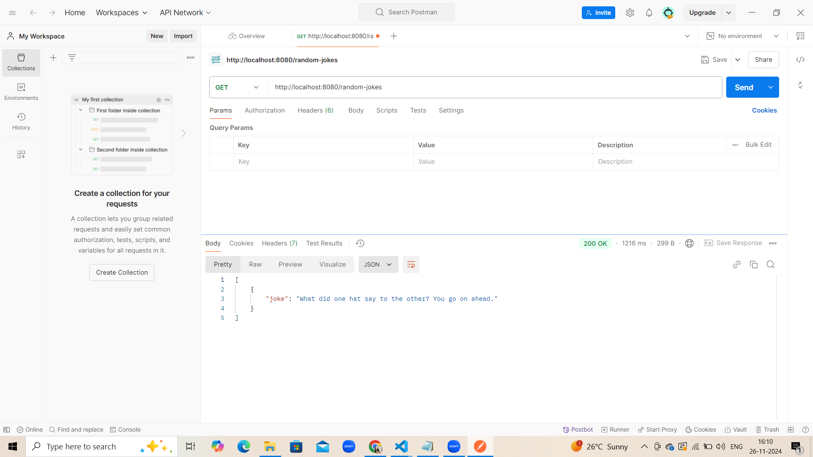

# Random Jokes API
A simple Node.js-based API that fetches random dad jokes using the API Ninjas Dad Jokes API. This project demonstrates how to create a basic Express server and integrate with third-party APIs.

## Features
Fetch random dad jokes with a single endpoint.
Demonstrates the use of dotenv for secure API key management.
Handles errors gracefully with appropriate HTTP status codes.
Installation
Prerequisites
Ensure you have the following installed:

Node.js (version 14 or higher)
npm (comes with Node.js)

## Usage
The API exposes the following endpoint:

GET /random-jokes
Fetch a random dad joke.

Example Request
GET http://localhost:8080/random-jokes

Example Response
json
Copy code
[
  {
    "joke": "Why don’t skeletons fight each other? They don’t have the guts."
  }
]
Testing
You can test the API using tools like:

Postman
curl
Example curl Command:

Project Structure
plaintext
Copy code
project-folder/
│
├── index.js          # Main server file
├── package.json      # Project dependencies and scripts
├── .env              # Environment variables (not included in repo)
└── README.md         # Documentation

## Technologies Used
Node.js: JavaScript runtime for server-side programming.
Express: Framework for building RESTful APIs.
Axios: HTTP client for API calls.
dotenv: For managing environment variables.
Error Handling
If the API key is missing or invalid, a 500 Internal Server Error will be returned with the message:

json
Copy code
{ "error": "Failed to fetch jokes" }
Future Enhancements
Add more endpoints for different types of jokes.
Implement rate limiting to prevent abuse.
Deploy the API to a cloud platform (e.g., Heroku, Vercel).
License
This project is licensed under the MIT License.